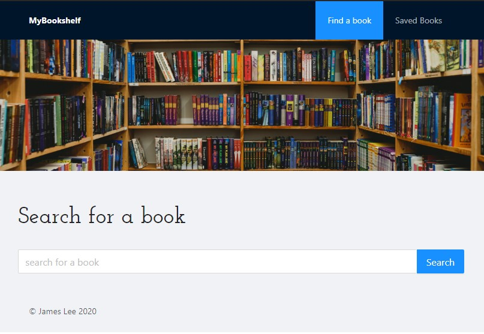

# My Bookshelf

A web application for finding books using the google books API, and saving them to your bookshelf.  Can be found online [here](https://mylibrary-jl.herokuapp.com/).

## Technologies

* Node
* Express
* React
* MongoDB
* Mongoose
* Ant Design React Components
* AOS
* Sass

## Usage

From the search page, enter a search in the text field.  Search can contain author, title, any details you want.  Either pressing Enter or the Search button will populate the area below with up to ten results from Google Books.  Pressing the view button will open that result in Google Books in a new tab, pressing save will save that book to your personal library.

On the Saved Books page, the page will populate with all of the books you've chosen to save.  You can view them in Google Books by clicking the View button, or delete the book with the delete button.

## Author

Created by James Lee

## Credits

* [Node](https://nodejs.org/en/)
* [Express](https://expressjs.com/)
* [React](https://reactjs.org/)
* [MongoDB](https://www.mongodb.com/)
* [Mongoose](https://mongoosejs.com/docs/)
* [Sass](https://sass-lang.com/)
* [Ant Design](https://ant.design/)
* [Animate On Scroll](https://michalsnik.github.io/aos/)

## License

[MIT](https://choosealicense.com/licenses/mit/)